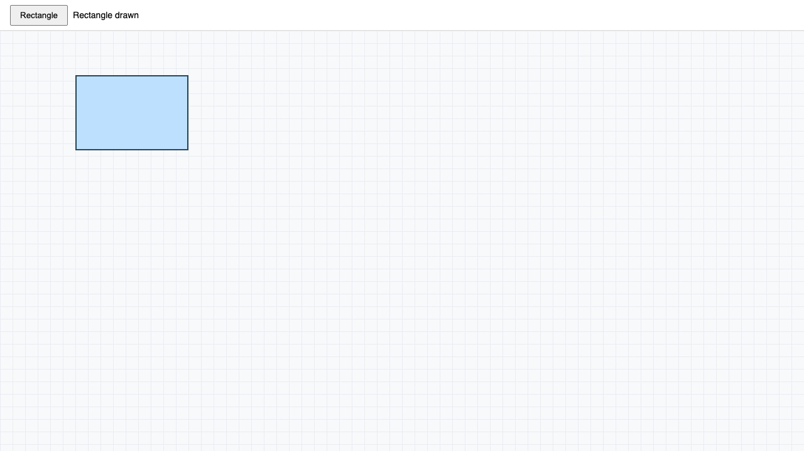
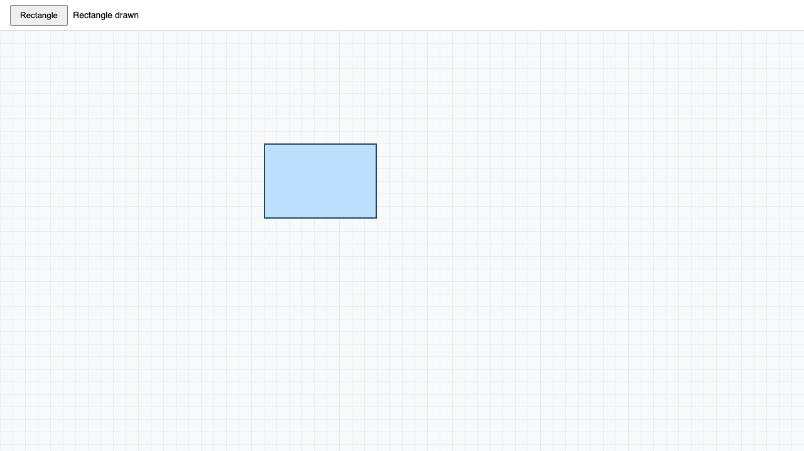
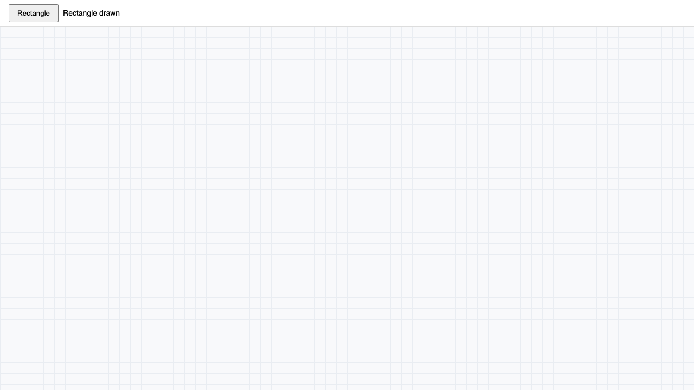
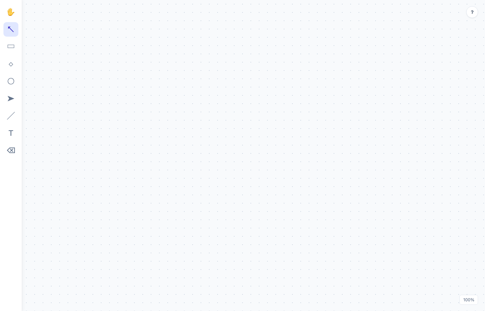

# Archidraw

Archidraw is a local, MCP-controlled whiteboard: Claude Code edits a scene and the Vite GUI renders it live through a localhost bridge.



## Quickstart

```bash
pnpm i && pnpm build && pnpm dev:gui
```

In a second terminal, start the bridge:

```bash
pnpm dev:bridge
```

Open <http://localhost:5173>.

## MCP registration

Add this object to Claude Code's `~/.claude.json` (replace `<clone>` with the absolute clone path):

```json
{
  "mcpServers": {
    "archidraw": {
      "command": "pnpm",
      "args": ["-C", "<clone>", "exec", "archidraw-mcp", "--db", "/tmp/archidraw.db"]
    }
  }
}
```

Restart Claude Code or run `/mcp`. The `archidraw` server exposes nine scene tools.

## Try this prompt

Open localhost:5173, then in Claude Code: `Create a rectangle named 'auth' at 200,200`. Confirm the rectangle appears in the GUI.

## Architecture

```text
┌──────────────┐    scene deltas    ┌──────────────┐    tool calls    ┌──────────────┐
│ GUI :5173    │ <────────────────> │ bridge :5174 │ <──────────────> │ MCP (stdio)  │
│ Vite + React │                    │ local SSE    │                    │ 9 tools      │
└──────────────┘                    └──────────────┘                    └──────────────┘
```

The layered design is described in [docs/architecture.md](docs/architecture.md). For Zed and Continue, see [docs/quickstart-mcp.md](docs/quickstart-mcp.md).

## Screenshots

| Draw | Query | Update | Delete |
|---|---|---|---|
|  |  |  |  |

### MCP agent architecture (live-drawn via bridge SSE)



The diagram above was created by sending 22 `create_element` tool calls through the running MCP server, then broadcast over the bridge SSE pipeline (MCP → store.subscribe → HttpBridgeTransport → bridge publish → GUI EventSource → store patch → canvas re-render). End-to-end latency ≈ 100ms.

## Development

```bash
pnpm -r build
pnpm test
pnpm e2e
```

Docker, Docker Compose, CI workflows, and automatic versioning are intentionally outside this MVP.
